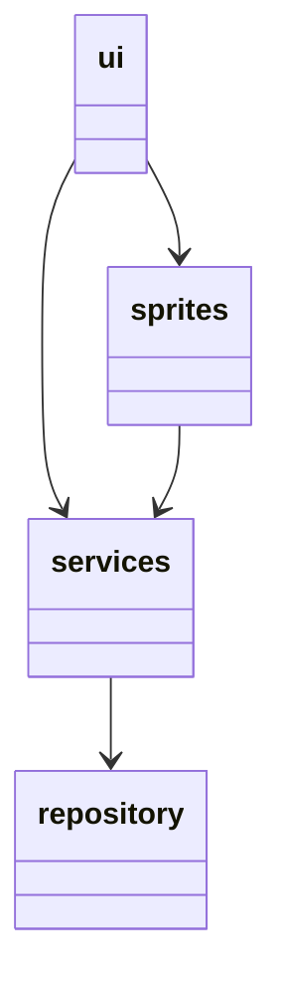
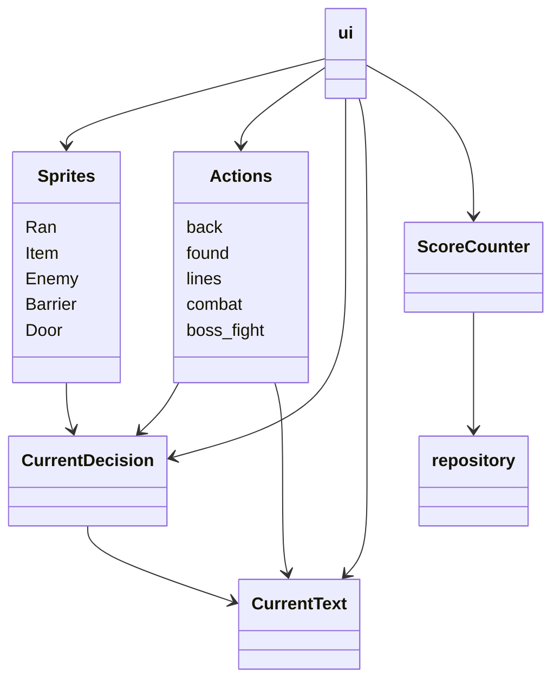

### Arkkitehtuurikuvaus

## Rakenne
Pakkaus ui sisältää käyttölittymän koodin. Pakkaukset services ja sprites sisältävät sovelluslogiikasta vastaavan koodin. Pakkaus repository sisältää koodin, joka vastaa pysyväistallennuksesta tietokantaan.

## Käyttöliittymä
Käyttöliittymä sisältää:
 
* aloitusnäyttö
 
* pelinäkymä
  - kolme eri tasoa
  - oveworld-näkymä ylhäällä
  - tekstilaatikko alhaalla
  
* lopetusnäyttö
 
 ## Sovelluslogiikka
Sovelluslogiikan suorittamisesta vastaa pakkauksessa services olevat luokat; spritet, Actions, CurrentDecision, CurrentText ja ScoreCounter.
Sprite oliot vastaavat eri esineisiin ja pelihahmoon liittyvistä toiminnallisuuksista. Actions-luokka vastaa CurrentDecision ja CurrentText luokkien kanssa tekstitapahtumiin liittyvistä toiminnallisuuksista. ScoreCounter vastaa tulokseen liittyvästä toiminnallisuudesta.

 Pakkaus/luokkakaavio, joka kuvaa luokkien suhdetta:

## Toiminnallisuus

