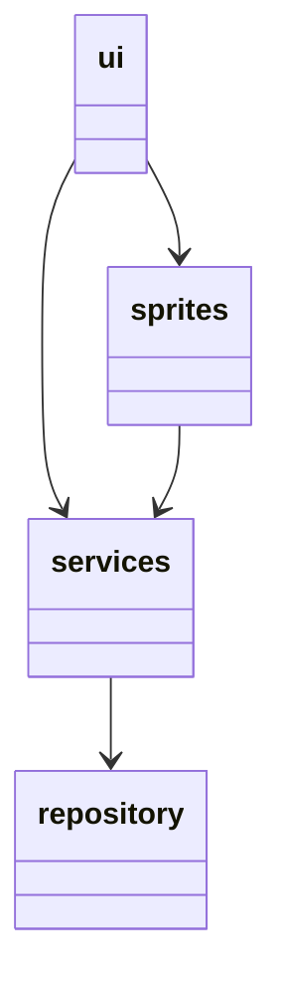
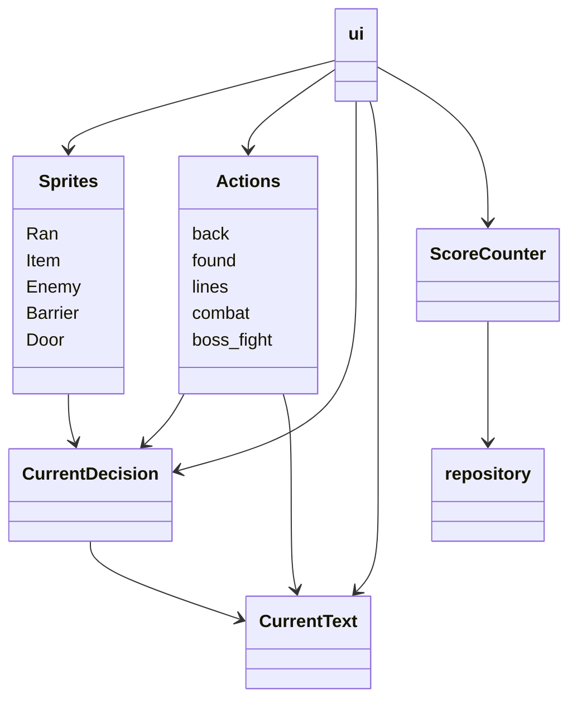

# Arkkitehtuurikuvaus

## Rakenne
Pakkaus ui sisältää käyttölittymän koodin. Pakkaukset services ja sprites sisältävät sovelluslogiikasta vastaavan koodin. Pakkaus repository sisältää koodin, joka vastaa pysyväistallennuksesta tietokantaan.

## Käyttöliittymä
Käyttöliittymän sisältämät eri näkymät:
 
1. Aloitusnäyttö
2. Pelinäkymä
   - Kolme eri tasoa
   - Overworld-näkymä ylhäällä
   - Tekstilaatikko alhaalla
3. Lopetusnäyttö

Kun peli ei ole käynnissä käyttäjä näkee aloitus- tai lopetusnäytön. Aloitusnäytöstä vastaa 
[StartingScreen](https://github.com/emlyy/ot-harjoitustyo/blob/master/src/ui/starting_screen.py)-luokka ja Lopetusnäytöstä [EndingScreen](https://github.com/emlyy/ot-harjoitustyo/blob/master/src/ui/ending_screen.py)-luokka. Kun peli on käynnissä käyttäjä näkee yhden tasoista. Pelinäkymän eri tasoista ja niissä käytettävistä spriteistä vastaa [SpriteSet](https://github.com/emlyy/ot-harjoitustyo/blob/master/src/ui/sprite_setter.py)-luokka. 
[Game](https://github.com/emlyy/ot-harjoitustyo/blob/master/src/ui/game.py)-luokka vastaa näytön päivittämisestä; spritejen ja tekstien piirtäminen. [Events](https://github.com/emlyy/ot-harjoitustyo/blob/master/src/ui/events.py)-metodi vastaa käyttäjän syötteen lukemisesta. [Restart](https://github.com/emlyy/ot-harjoitustyo/blob/master/src/ui/restart.py)-metodi vastaa uudelleenaloittamisesta.

 ## Sovelluslogiikka
Sovelluslogiikan suorittamisesta vastaa pakkauksessa services olevat luokat; eri [spritet](https://github.com/emlyy/ot-harjoitustyo/tree/master/src/sprites), [Actions](https://github.com/emlyy/ot-harjoitustyo/blob/master/src/services/actions.py), [CurrentDecision](https://github.com/emlyy/ot-harjoitustyo/blob/master/src/services/current_decision.py), [CurrentText](https://github.com/emlyy/ot-harjoitustyo/blob/master/src/services/current_text.py) ja [ScoreCounter](https://github.com/emlyy/ot-harjoitustyo/blob/master/src/services/score_counter.py).
Sprite oliot vastaavat eri esineisiin ja pelihahmoon liittyvistä toiminnallisuuksista. [Actions](https://github.com/emlyy/ot-harjoitustyo/blob/master/src/services/actions.py)-luokka vastaa [CurrentDecision](https://github.com/emlyy/ot-harjoitustyo/blob/master/src/services/current_decision.py) ja [CurrentText](https://github.com/emlyy/ot-harjoitustyo/blob/master/src/services/current_text.py) luokkien kanssa tekstitapahtumiin liittyvistä toiminnallisuuksista. [ScoreCounter](https://github.com/emlyy/ot-harjoitustyo/blob/master/src/services/score_counter.py) vastaa tulokseen liittyvästä toiminnallisuudesta.

 Pakkaus/luokkakaavio, joka kuvaa luokkien suhdetta:

## Tietojen pysyväistallennus
[Data](https://github.com/emlyy/ot-harjoitustyo/blob/master/src/repository/scores.py)-luokka vastaa tuloksien talletamisesta SQL-tietokantaan.

## Päätoiminnallisuudet
### Liikkuminen
Hahmon liikkuminen sekvenssikaaviona:

Käyttöliittymän [events](https://github.com/emlyy/ot-harjoitustyo/blob/master/src/ui/events.py)-metodi tarkistaa ensin, mitä näppäimiä käyttäjä painaa. [Main](https://github.com/emlyy/ot-harjoitustyo/blob/master/src/main.py) kutsuu peli-silmukassa `all_sprites.update`, joka kutsuu kaikkien `all_sprites`-ryhmän spritejen `update`-metodeja. Tällöin pelihahmo [Ran](https://github.com/emlyy/ot-harjoitustyo/blob/master/src/sprites/ran.py)-luokan `update` kutsuu `move`-metodia. Tämän jälkeen, jos liikkumista ei ole estetty päivitetään koordinaatit ja tarkistetaan `collision`-metodilla, ettei hahmo törmää seiniin. Lopuksi 
[Game](https://github.com/emlyy/ot-harjoitustyo/blob/master/src/ui/game.py)-luokan `draw`-metodi piirtää hahmon uuteen kohtaan.

### Törmääminen:

Törmääminen esineisiin ja vihollisiin tarkistetaan pitkälti samalla tavalla, kuin hahmon törmääminen seiniin. Ensin kutsutaan spritejen `update`-metodeja. Jokaisen esineen/vihollisen `update`-metodi tarkistaa `collision`-metodin avulla, onko pelaaja törmännyt siihen. Kun törmäys tapahtuu, `collision`-metodin sisältä kutsuaan [Actions](https://github.com/emlyy/ot-harjoitustyo/blob/master/src/services/actions.py)-luokkaa.

[Actions](https://github.com/emlyy/ot-harjoitustyo/blob/master/src/services/actions.py)-luokan `found`-metodi kutsuu [CurrentDecision](https://github.com/emlyy/ot-harjoitustyo/blob/master/src/services/current_decision.py)-luokkaa päivittämään tämänhetkiset valintavaihtoehdot ja [CurrentText](https://github.com/emlyy/ot-harjoitustyo/blob/master/src/services/current_text.py)-luokkaa päivittämään tekstit. `Found`-metodi päivittää myös 
[Game](https://github.com/emlyy/ot-harjoitustyo/blob/master/src/ui/game.py)-luokan muuttujat `can_move` ja `decisions`.

Nyt kun [main](https://github.com/emlyy/ot-harjoitustyo/blob/master/src/main.py) kutsuu [events](https://github.com/emlyy/ot-harjoitustyo/blob/master/src/ui/events.py)-metodia uudelleen, niin [events](https://github.com/emlyy/ot-harjoitustyo/blob/master/src/ui/events.py) tarkistaa onko käyttäjä vallinnut toisen tekstivaihtoehdoista. Kun Käyttäjä valitsee toisen vaihtoehdoista, [events](https://github.com/emlyy/ot-harjoitustyo/blob/master/src/ui/events.py) tarkistaa valintalaatikon `d_box` koordinaatit ja valinnan `str(text_decisions)`. Sitten [events](https://github.com/emlyy/ot-harjoitustyo/blob/master/src/ui/events.py) kutsuu [Actions](https://github.com/emlyy/ot-harjoitustyo/blob/master/src/services/actions.py)-luokan metodeja `update_current(valinta)` ja `act`. Näin päivittyy tämänhetkinen tapahtuma ja tapahtuma käynnistetään.

Törmääminen viholliseen sekvenssikaaviona:

### Tapahtumat:
Kun tapahtumaa on kutsuttu suoritettavaksi, [Actions](https://github.com/emlyy/ot-harjoitustyo/blob/master/src/services/actions.py)-luokan muuttuja `counter` pitää kirjaa siitä, kuinka monta kertaa käyttäjä on painanut space-nappia. Aina kun käyttäjä painaa space-nappia, [events](https://github.com/emlyy/ot-harjoitustyo/blob/master/src/ui/events.py) kutsuu tapahtumaa ja `counter` kasvaa yhdellä. Kun `counter` ylittää jonossa olevien tekstien määrän, tapahtuma päätty. [Actions](https://github.com/emlyy/ot-harjoitustyo/blob/master/src/services/actions.py)-luokan metodi `back` palauttaa pelitilan takaisin normaaliksi; tekstit häviävät ja hahmoa voi liikuttaa.
