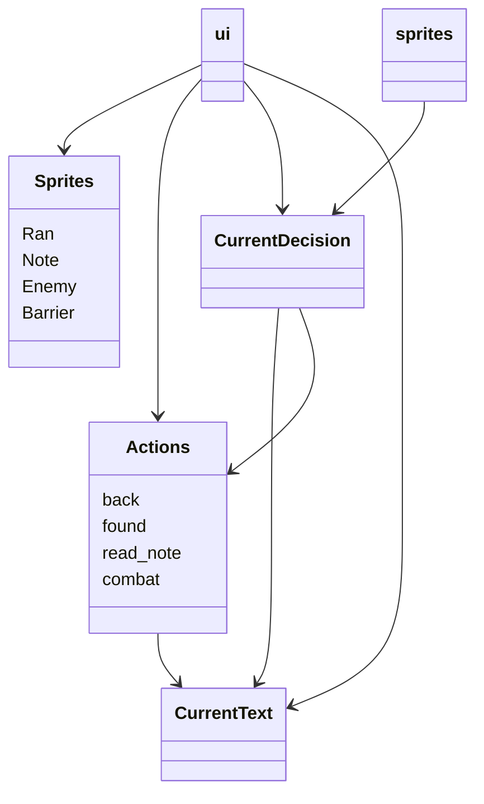

```mermaid
 classDiagram
      ui --> Sprites
      class Sprites{
          Ran
          Note
          Enemy
          Barrier
      }
      ui --> Actions
      class Actions{
          back
          found
          read_note
          combat
      }
      ui --> CurrentDecision
      CurrentDecision --> CurrentText
      ui --> CurrentText
      sprites --> CurrentDecision
      CurrentDecision --> Actions
      Actions --> CurrentText
```

.png)
